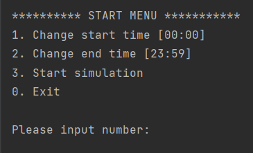
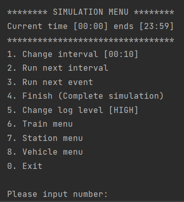

# trains

Program with a command-line interface that acts like a prototype for a fictional railway company. It simulates a 24 hour day and manages the assembling of train carts, departures and the speed of the trains. The program loads all data from three txt-files and outputs to a log-file during runtime. 

Was done as a project in a C++ course at Mid Sweden University.

